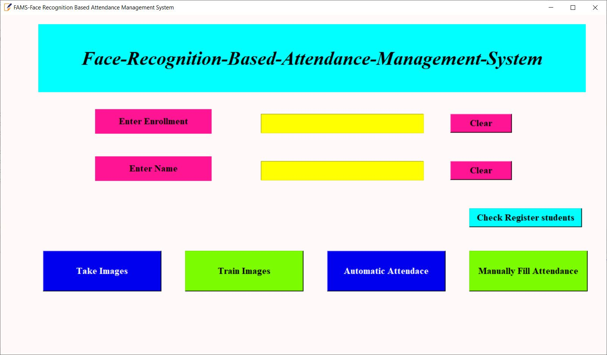

- This project is used to take attendance of student using Face Recognition.
- User can take attendance using face recognition as well as manually.
- All the data are stored inside CSV files
 
<b>Dependency Used:</b>
- tkinter : for GUI design
- openCV : for image processing
- pandas : for data formatting in CSV file
 
<b>Result:</b>

